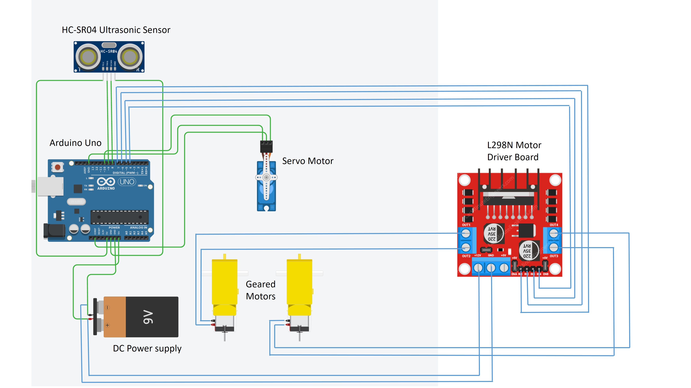

# Smart Tank Project

<div id="header" align="center">
  
</div>

Welcome to the Smart Tank Project! This project is designed to create an autonomous tank-like vehicle using various sensors and microcontrollers.

## Features

- **Obstacle Detection**: Uses sensors to detect and avoid obstacles.
- **Speed Control**: Adjusts speed based on the environment and obstacles.

## Devices Used

- **Arduino Uno**: The main microcontroller used for processing sensor data and controlling the tank.
- **Ultrasonic Sensor (HC-SR04)**: Used to detect obstacles in the tank's path.
- **Motor Driver (L298N)**: Used to control the motors of the tank.
- **DC Motors (12V)**: Used to drive the tracks of the tank.
- **Battery Pack**: Consists of 3pcs 3.7V lithium-ion batteries, outputting 12V.
- **Chassis**: The frame of the tank that holds all the components.

## Circuit Diagram

<div id="header" align="center">
  
</div>

## Installation

1. **Clone the repository**:

   ```bash
   git clone https://github.com/yourusername/smart_tank.git
   ```

2. **Navigate to the project directory**:

   ```bash
   cd smart_tank
   ```

3. **Upload the code to the Arduino**:
   - Right-click on the `smart_tank.ino` file and select "Open in Arduino IDE".
   - Alternatively, open the Arduino IDE, click "File" > "Open", and navigate to the `smart_tank.ino` file in the repository folder.
   - Connect your Arduino to your computer.
   - Upload the code to the Arduino.

## Usage

1. **Set up the hardware**:

   - Connect the ultrasonic sensor, motor driver, and DC motors to the Arduino as per the circuit diagram.
   - Assemble the components on the chassis.

2. **Power on the system**:

   - Ensure the Arduino and all connected devices are powered on.

3. **Control the tank**:
   - The tank will automatically detect and avoid obstacles.

## Demo Videos

Watch the demo videos to see the Smart Tank in action, including the programming and testing process:

[](https://youtube.com/shorts/8DP5RMeq7DQ?feature=share)

[](https://youtu.be/tdRVfecM6ZA)

## Recommendations

### Preventing Overheating

1. **Heatsinks**: Attach heatsinks to high-power components like the motor driver (L298N). Heatsinks increase the surface area for heat dissipation, helping to keep the components cool.
2. **Fans**: Incorporate small fans to provide active cooling. Fans help circulate air around the components, removing warm air and bringing in cooler air.
3. **Proper Ventilation**: Ensure that the tank's enclosure has adequate ventilation. Avoid placing components in enclosed spaces where heat can build up.
4. **Thermal Interface Materials**: Use thermal paste or pads between components and heatsinks to improve heat transfer by filling air gaps.
5. **Temperature Sensors**: Integrate temperature sensors to monitor the operating temperature of your components in real-time. This allows you to detect unusual temperature spikes and take action before damage occurs.

### Short Circuit Protection

1. **Fuses**: Use fuses to protect against overcurrent conditions. Fuses will blow when the current exceeds a specified limit, breaking the circuit and stopping the flow of electricity.
2. **Circuit Breakers**: Install circuit breakers that can automatically interrupt the flow of electricity when an overcurrent is detected. Circuit breakers can be manually reset once the fault is resolved.
3. **Resettable Fuses (PPTC)**: Consider using resettable fuses, which automatically reset after cooling down. These devices change resistance when the current exceeds a certain level, interrupting the circuit.
4. **Proper Wiring and Insulation**: Ensure that all wiring is properly insulated and that there are no exposed wires that could cause short circuits. Use high-quality connectors and avoid placing conductors too close together.
5. **Overcurrent Protection Circuits**: Implement overcurrent protection circuits that can detect excessive current and shut down the system to prevent damage.

By incorporating these measures, you can improve the safety and reliability of your Smart Tank project, preventing overheating and protecting against short circuits.

## Credits

This project was inspired by and uses information from [this YouTube video](https://www.youtube.com/watch?v=kPSBpfUpHt0&t=4s). The original code can be found [here](https://drive.google.com/file/d/11FJMN_PGLD_yJdtuzxBiAzmhhfKUOvxV/view). The original circuit diagram can be found [here](https://drive.google.com/file/d/1EpYapeHpuXFgmIY0kVXYZU-h94mlpfeA/view).

## Contact

For any questions or support, please reach out to me via email at daverhandon@gmail.com or connect with me on [LinkedIn](https://www.linkedin.com/in/dave-rhandon-blas-b670b1279) or [Facebook](https://www.facebook.com/people/Rhandon-Dave/100010657007416/).

Thank you for checking out the Smart Tank Project!
